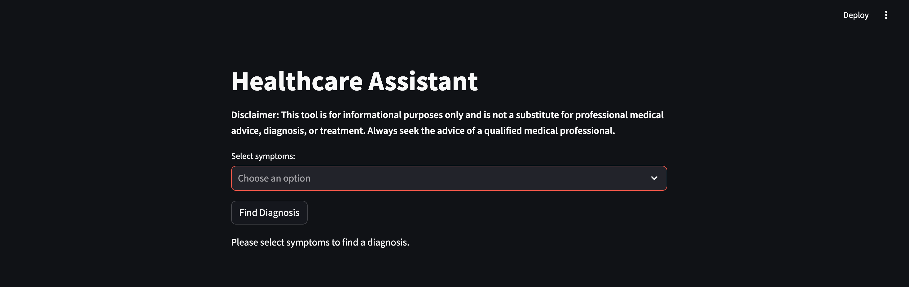

# Healthcare Assistant App to help diagnose illnesses and suggest remedies

# Tech Stack used:
* Python
* Weaviate
* Streamlit
* Docker

# [Dataset used](https://www.kaggle.com/datasets/itachi9604/disease-symptom-description-dataset)

# Goal
To create an app where user can input symptom data and receieve possible diagnoses with best symptom match along with a custom severity score, description and remedies.

# Methodology
* Inital exploration of datasets within jupyter notebook
* To encode symptom and diagnosis data using a [BioBERT](https://huggingface.co/dmis-lab/biobert-v1.1) tokenizer from huggingface
* Diagnoses and symptom encodings are stored within the weaviate DB for later use
* Diagnoses suggestions are based upon cosine similarity of symptom inputs, whereby a diagnosis is linked with different combinations of symptoms.  The input form the user is vectorised and aggregated. The resulting vector is compared directly to the diagnosis vectors stored within weaviate.
* The most similar vector is the most lilely diagnosis. The top 5 most similar diagnoses are displayed along with further useful metrics.
* Front-end is hosted using streamlit
* The app is dockerised for ease of use.

# To run:
* `docker pull cmaxk/weaviate-healthcare-assistant:latest`
* `docker-compose build`
* `docker-compose up`
* Please wait whilst the embeddings are generated - this can take a while. Once you see the output *'Diagnosis embeddings generated and stored'* the app will be ready to use on *http://localhost:8501*

# Using the App:

## App Homescreen:

## Symptom Selection:

## Multiple symptom input:

## Output:

